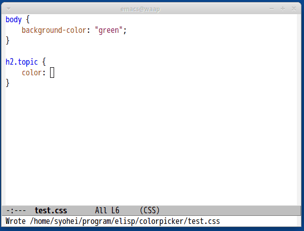

# colorpicker.el

Emacs port of Sublime Text plugin [ColorPicker](https://github.com/weslly/ColorPicker).

## Requirements
- Python
- PyGtk

I think [python script](script/colorpicker.py) works well on GTK based distributions
like Gnome, XFce4 etc.

## Demo

## Commands

#### `M-x colorpicker`

Select color and insert/replace with picked color.
